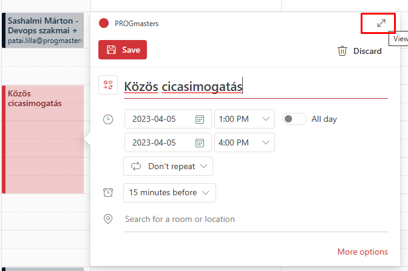
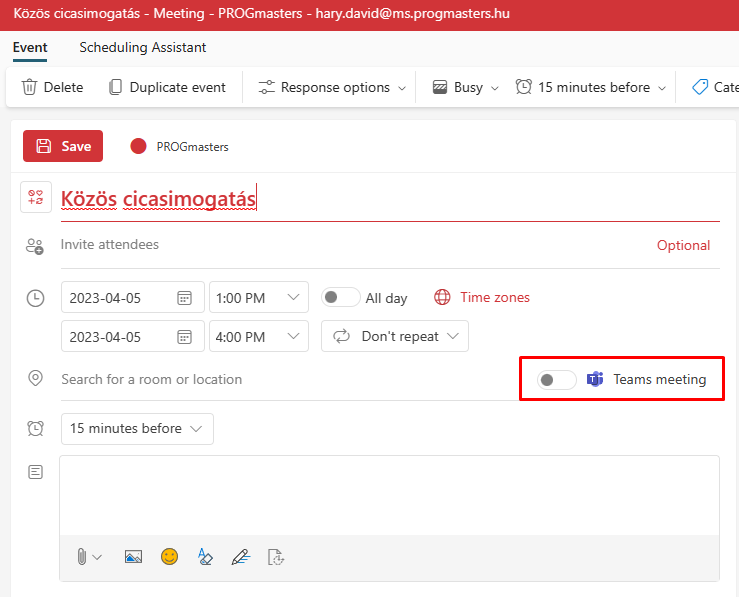
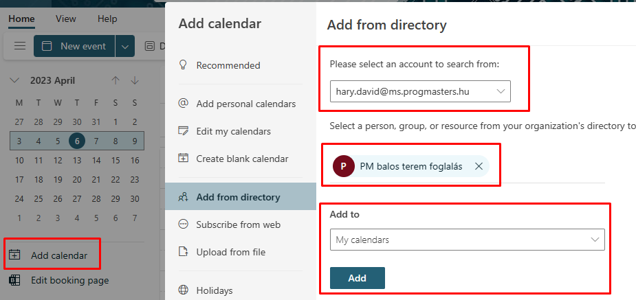
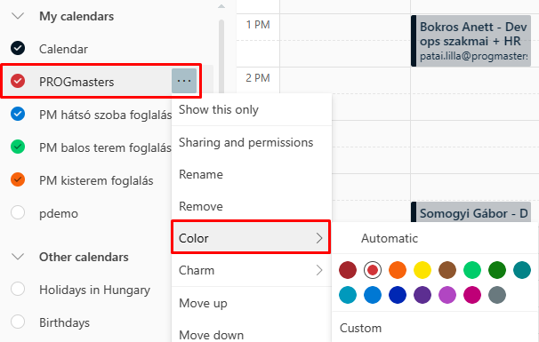

# PROGmasters - Google > Microsoft migráció project
## Calendar

### Link
https://outlook.office.com/calendar

### Új esemény
Használata nagyon hasonló a Google calendarhoz akár fent a `New event` gombbal, akár a naptárban az időpontra kattintva lehet új eseményt csinálni. Felül `Save gomb` mellett látható, hogy melyik naptárhoz szeretnénk eseményt hozzáadni. Ha mást is meg szeretnénk hívni az eseményre, akkor itt is meg fog jelenni a többi fél elfoglaltsága - de csak házon belül mutatja. Létrehozható Teams meeting az eseményekre, ha meghívsz valakit, akkor automatikusan létrejön. A lehetőség csak az advanced módban jön elő, amit a jobb fenti nyilacskával lehet előhívni:  
  
Utána válik láthatóvá az opció:  

### Naptárra feliratkozás
Van lehetőség a közös naptárakra feliratkozni. A jelenlegi gyakorlatot követve a közös naptár és a szoba/teremfoglalások itt lesznek nyilvántartva. Feliratkozás menete: `Add calendar > Add from directory > itt válaszd ki a saját accountodat ` majd a következő mezőbe kell írni, hogy milyen naptárra szeretnél feliratkozni. A közös naptárak `calendar_`-al kezdődnek, ha ezt beírod, akkor fel fogja dobni ezeket a lehetőségeket. `Add to` opciónál pedig tanácsos a `My calendars`-t választani.  

### Színezés
Elég értelmetlen módon alapból random színeket ad a naptáraknak *(minden megnyitásnál)*, ezt lehet fixálni a naptár tulajdonságainál.  

### Megosztás
Természetesen van lehetőség több naptár létrehozására és azok megosztására a Sharing and permissions alatt. Írási jogot csak házon belül tudunk adni egymásnak, külsős csak láthatja az eseményeinket.
