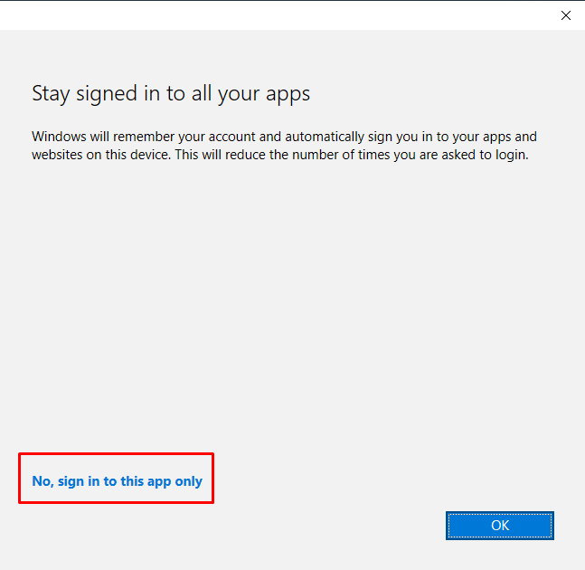

# PROGmasters - Google > Microsoft migráció project
## Office
### Letöltési link
https://portal.office.com/account  

View apps and devices > Nyelv tetszőlegesen választható > Verzió maradhat alapértelmezetten 64-bit. Ez letölti a telepítőt, amibe szintén be kell jelentkezni a progmasters-es accounttal. A Devices rész alatt menedzselhetők a telepített példányok, egyszerre 5 példány lehet (telefon/tablet nem foglal licenszt). Amelyikre nincs szükségünk, azt törölhetjük a listából.  
  
Amikor telepítesz valamilyen Microsoft appot (pl Office, Teams, bármi) és bejelentkezel a céges fiókkal; jó tanács:  
  
Ilyen ablaknál ne az OK-ra, hanem a **No, sign in to this app only**-ra nyomj, mert különben hozzácsatolja a céges profilodat a géphez és azt nehéz lesz onnan levakarni már.
